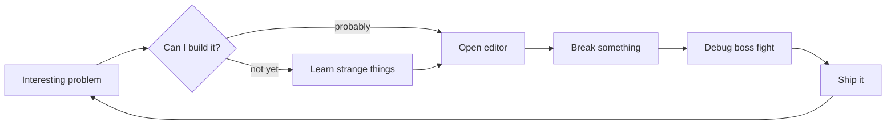

# Hi, I’m Kareem 👾

```console
$ whoami
Kareem — builder, curious mind, professional tab collector.
```

I turn vague ideas into useful things using code, stubborn curiosity, and the ancient engineering ritual of asking:

> “Why does this work—and can I make it stranger?”

```txt
curiosity  > convention
signal     > noise
shipping   > speculating
gg         > rage quit
```

### Runtime Architecture



### Quest Log

- `[MAIN]` Build things that deserve to exist
- `[SIDE]` Explore clever systems and tiny details
- `[DAILY]` Learn something new
- `[BOSS]` Name variables properly
- `[PASSIVE]` Accumulate browser tabs

### Player Stats

```txt
Curiosity       ████████████████████  100
Persistence     ██████████████████░░   90
Debugging       ███████████████░░░░░   75
Documentation   ████████████░░░░░░░░   60
Stopping        ███░░░░░░░░░░░░░░░░   15
```

### Contribution Serpent 🐍


> Green build: intentional. Red build: the plot is developing.

```console
$ git status --short
M  myself
```
