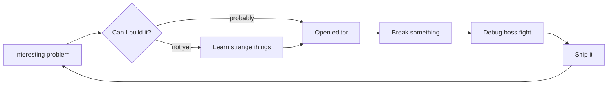

# `KAREEM.exe`

```console
$ whoami
Kareem — builder, curious mind, professional tab collector.

$ uptime
still learning...
```

I turn vague ideas into useful things using code, stubborn curiosity, and the ancient engineering ritual of asking: *“but why does that work?”*

```txt
curiosity  > convention
signal     > noise
shipping   > speculating
gg         > rage quit
```

## Runtime architecture



## Current quest log

- `[MAIN]` Build things that deserve to exist
- `[SIDE]` Explore clever systems and tiny details
- `[DAILY]` Learn one thing I did not know yesterday
- `[BOSS]` Name variables properly
- `[PASSIVE]` Accumulate browser tabs

## Player stats

```txt
Curiosity       ████████████████████  100
Persistence     ██████████████████░░   90
Debugging       ███████████████░░░░░   75
Documentation   ████████████░░░░░░░░   60
Knowing when
to stop coding  ███░░░░░░░░░░░░░░░░   15
```

## Contribution serpent

<picture>
  <source media="(prefers-color-scheme: dark)" srcset="https://raw.githubusercontent.com/KaReeeeeeeeEM/KaReeeeeeeeEM/output/github-contribution-grid-snake-dark.svg">
  <source media="(prefers-color-scheme: light)" srcset="https://raw.githubusercontent.com/KaReeeeeeeeEM/KaReeeeeeeeEM/output/github-contribution-grid-snake.svg">
  
</picture>

<sub>🐍 <a href="https://KaReeeeeeeeEM.github.io/KaReeeeeeeeEM/snake.html">Enter interactive Snake Mode with sound</a>.</sub>

> If the build is green, I meant to do that. If it is red, the plot is developing.

```sh
$ git status --short
M  myself
```
